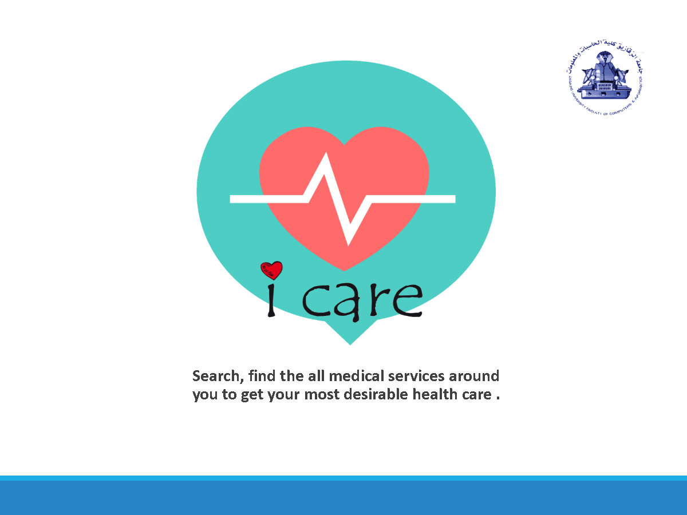
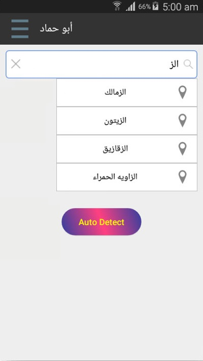
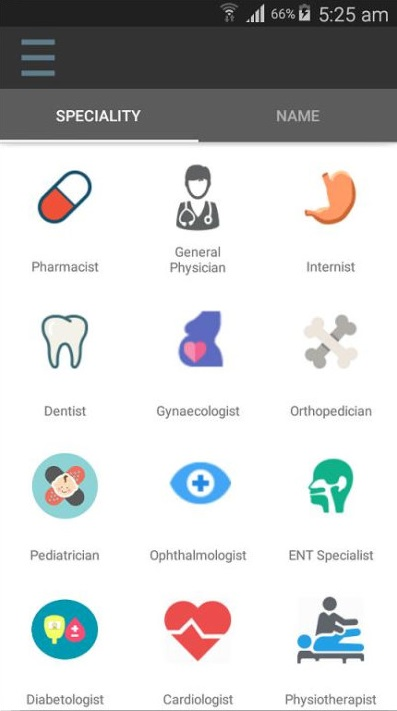

# I-Care
Search, find the all medical services around you to get your most desirable health care .

  <a href="screenshots/end.pdf" class="image fit">PDF Preview </a>

  
  
  
  

<object data="https://github.com/ZaTribune/I-Care-Public/tree/master/screenshots/end.pdf" type="application/pdf" width="700px" height="700px">
    <embed src="https://github.com/ZaTribune/I-Care-Public/tree/master/screenshots/end.pdf">

This browser does not support PDFs. Please download the PDF to view it: <a href="https://github.com/ZaTribune/I-Care-Public/tree/master/screenshots/end.pdf">Download PDF</a>.

    </embed>
</object>

## Overview  
Welcome to I-Care !
Quick and easy to use: Download Android App to find a nearby Doctor or
Specialist and book an appointment instantly!
Booking an appointment with the doctor of your choice using your smartphone
is a common thing in the developed parts of the world.

## Key Features
* It has just 3 simple steps as Search for a Doctor, Pick an Appointment , Verify
Appointment . It is a mobile app , so patients can
book appointments from anywhere.
* This App helps patients to book appointments with doctors instantly, whether in the
location or any other location.
* We developed I-Care to help doctors start the business features with minimum
cost, because the hospital industry is a growing business.
* And of course, a responsive design, pretty nice performance, support for Android from API Level 16 .

## Android Support
 minSdkVersion 16
 
## Built With  
&nbsp;&nbsp;&nbsp;&nbsp;**Java** - The Main Programming Language and Framework.  
&nbsp;&nbsp;&nbsp;&nbsp;**Andoid SDK** - Software Platform for creating and delivering Android Applications.   
&nbsp;&nbsp;&nbsp;&nbsp;**Android Studio** - Java IDE.  
&nbsp;&nbsp;&nbsp;&nbsp;**Gradle** - Build tool & Dependency Management.  
&nbsp;&nbsp;&nbsp;&nbsp;**Retrofit** - A type-safe REST client for Android and Java.

## Authors  
   **Muhammad Ali Arafah** - find me on : [Twitter](https://twitter.com/ZaTribune), [LinkedIn](https://www.linkedin.com/in/zatribune).  

## Acknowledgments

